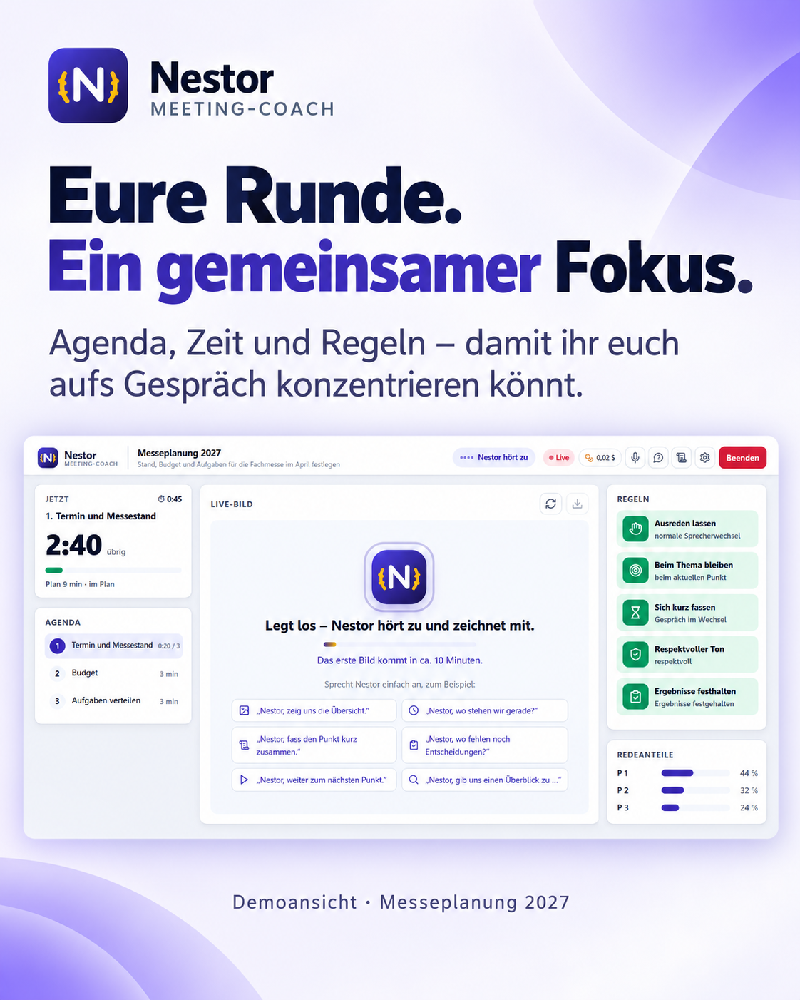
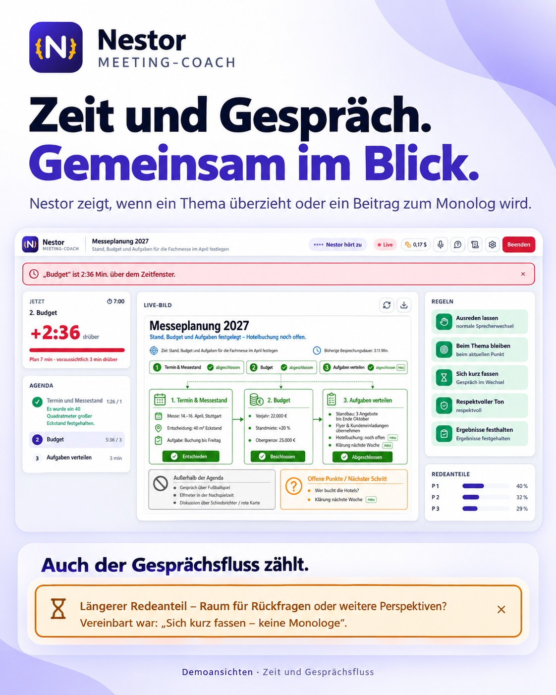
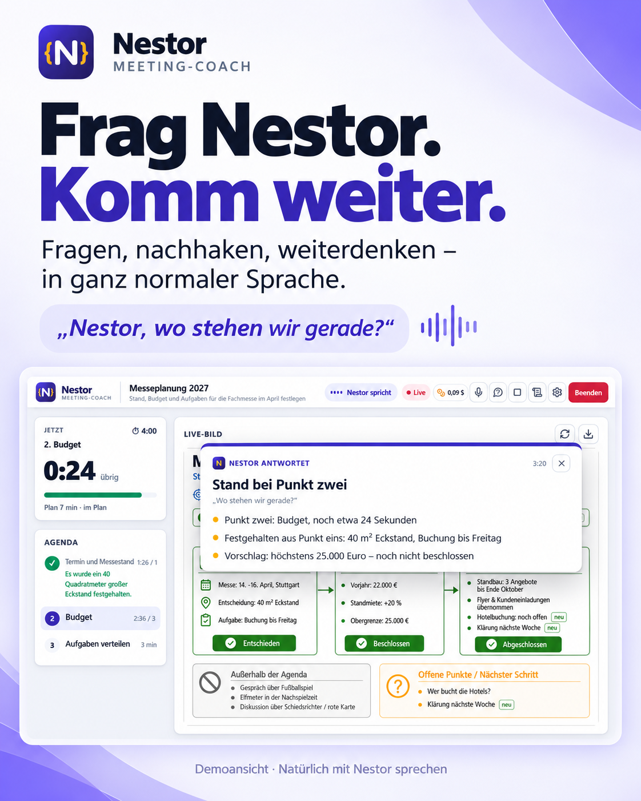
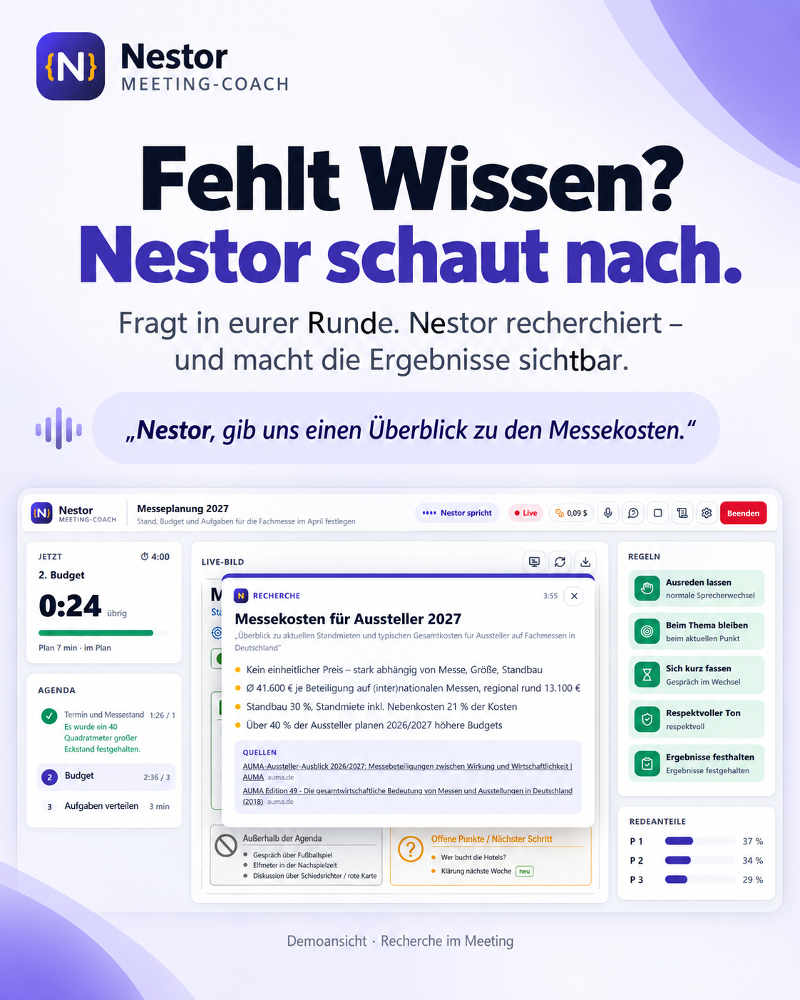
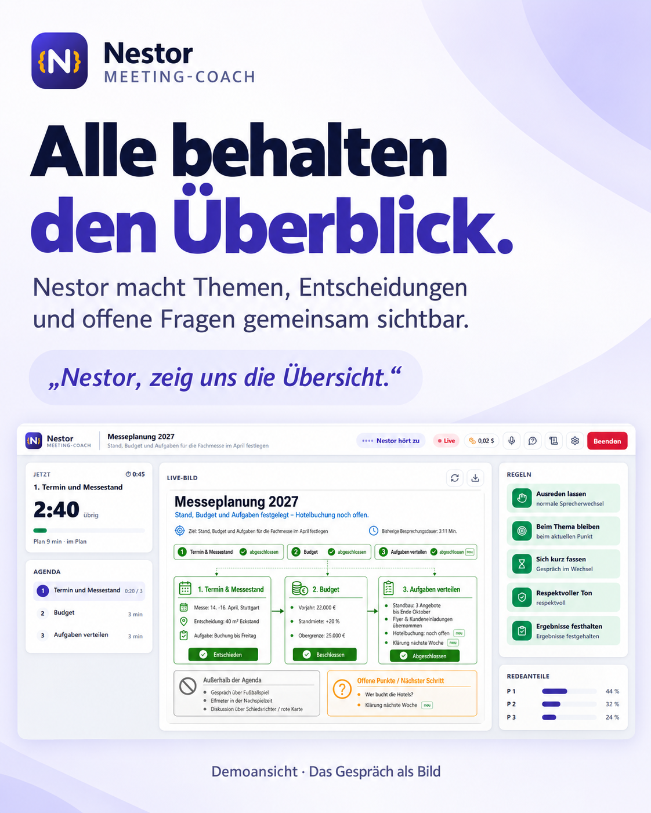
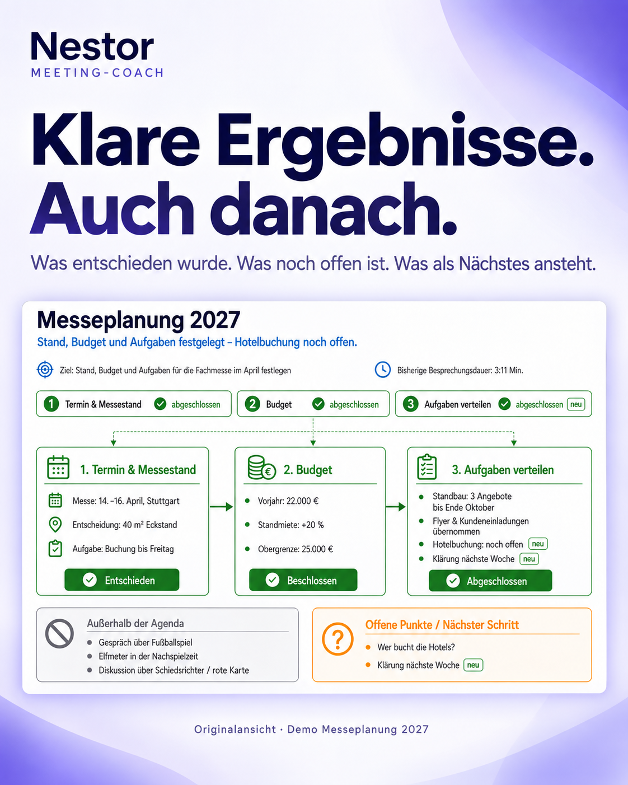

# Nestor – Live Meeting Coach

Nestor begleitet eure Besprechung: Er hält Agenda, Zeit und Gesprächsfluss im Blick und unterstützt
euch auf Ansprache in natürlicher Sprache. Er fasst Themen zusammen, recherchiert im Web und macht
Entscheidungen, Aufgaben und offene Fragen sichtbar. Die Gruppe entscheidet.

## Nestor in sechs Bildern

<table>
<tr>
<td><a href="demo/produktbilder/01-fokus.png"></a></td>
<td><a href="demo/produktbilder/02-gespraech.png"></a></td>
</tr>
<tr>
<td><a href="demo/produktbilder/03-aktiv.png"></a></td>
<td><a href="demo/produktbilder/04-recherche.png"></a></td>
</tr>
<tr>
<td><a href="demo/produktbilder/05-ueberblick.png"></a></td>
<td><a href="demo/produktbilder/06-ergebnisse.png"></a></td>
</tr>
</table>

Die Bilder zeigen die Demo „Messeplanung 2027“ mit Originalansichten der App.
[Produktbilder und Pitch](demo/produktbilder/README.md) · [Demo abspielen](demo/README.md) ·
[So sprecht ihr mit Nestor](docs/sprachassistent.md)

Grundlage: **Lastenheft „KI-gestützter Meeting-Assistent (MVP)“** (02.10.2026) und die
Version-2-Spezifikation (jetzt [docs/archiv/spezifikation_v2.md](docs/archiv/spezifikation_v2.md)). **Verbindlich ist das [Lastenheft](docs/lastenheft.md).**

## Was das Dashboard zeigt

- **Mitte: Live-Bild** – ein One-Pager zum Stand des Meetings (Kernaussage, Themen mit Status,
  Entscheidungen, offene Fragen, Beziehungen, Abschweifungen). Claude zeichnet ihn auf Knopfdruck,
  alle 10 Minuten und am Ende (~1,5–2 min je Bild) und schreibt das letzte Bild dabei fort.
- **Links:** Countdown des aktuellen Punkts, Agenda mit Status, Vorschlag zum Weiterschalten.
- **Rechts:** vier Signale (Monolog, Agenda & Zeit, Fokus, Sprecherüberlappung), aktueller Hinweis,
  Redeanteile ohne Bewertung.
- **Unten:** Live-Transkript mit laufendem Teiltext (nur Moderationsansicht).
- Gruppenansicht für den Beamer: `/meeting?ansicht=gruppe`.

## Schnellstart (Windows, Laptop)

```powershell
python -m venv .venv
.venv\Scripts\python -m pip install -r requirements.txt
.venv\Scripts\python scripts\modelle_laden.py   # lokale Modelle (~29 MB)
.venv\Scripts\python -m coach
```

Dann <http://127.0.0.1:8000> in Edge oder Chrome öffnen.

**Einfacher:** Doppelklick auf `Nestor starten.cmd` im Repo-Ordner. Das startet den Coach im Hintergrund und öffnet
das Dashboard als eigenes Fenster im Vollbild (F11 verlässt das Vollbild). Fenster zu = Coach aus; läuft noch ein
Meeting, fragt Nestor vorher. Ein schon laufender Coach wird mitbenutzt und bleibt dann an.

**Demo:** [demo/](demo/README.md) – ein dreiminütiges Meeting zum Abspielen im Dashboard, mit Screenshots und
der Meeting-Zusammenfassung als Bild.

- **Handy als Mikrofon und Fernbedienung:** `tailscale serve --bg 8000` (einmalig; HTTPS im eigenen Tailnet),
  dann im Dashboard auf das Handy-Symbol und den QR-Code scannen. Das Handy übernimmt Mikrofon und Nestors Stimme,
  hält das Display wach und lässt sich als App installieren – [docs/handy.md](docs/handy.md).
- **Meeting-Ablage:** Nach jedem Meeting legt der Coach einen Ordner unter `meetings/` an (nicht im Repo).
  Darin liegen Abschlussbild, `protokoll.md`, `bericht.json` (Transkript, Hinweise, Agenda, Karten, Dynamik,
  Kosten), die Aufnahme als WAV und unter `debug/` die Ereignisse, Nestors Antwortzeiten, die API-Aufrufe und das
  Log. Die Aufnahme lässt sich mit `scriptsbspielen.py` erneut durchspielen. Sie ist in den Einstellungen
  abschaltbar, die Kopfleiste zeigt „Aufnahme“, und nach einem „Nein“ in der Begrüßung wird sie gelöscht.
- **Eigener OpenAI-Schlüssel:** Jede Person trägt ihren API-Schlüssel im Dashboard unter Einstellungen ein
  (wird bei OpenAI geprüft, liegt dann nur in `~/.live-meeting-coach/openai_schluessel`, nie im Browser oder Log).
  Alternativ `OPENAI_API_KEY` in `.env`; der Eintrag im Dashboard hat Vorrang. Live-Text, Kontext, Nestor und
  Live-Bild laufen alle über diesen einen Schlüssel. Grobe Kosten je Meetingstunde: ~2 $ mit Bild alle 10 min.
- **Live-Text schnell oder sparsam** (Einstellungen): Standard ist „schnell“ (Streaming, Text schon beim
  Sprechen, ~1,02 $/h). „Sparsam“ schickt jede Äußerung einzeln (~0,36 $/h); Sätze erscheinen erst nach dem Satzende (im Mittel ~1 s, bis ~4 s)
  und Nestor antwortet entsprechend später. Sprecher, Redeanteile, Monolog und Unterbrechungen sind nicht betroffen.
- **Live-Bild über das Claude-Abo statt OpenAI** (kostenlos, Layout einfacher): `LMC_BILD_ANBIETER=claude`;
  braucht die Claude-Code-Kommandozeile mit angemeldetem Abo (Standard: Pi per `LMC_CLAUDE_BEFEHL`).
- **Testbibliothek:** Proben mit Referenz in [testbibliothek/](testbibliothek/README.md); Audio herstellen
  mit `scripts\bibliothek_laden.py`, danach im Dashboard unter „Aufnahme abspielen“. Kopflos mit
  Bericht: `scripts\abspielen.py`; Sprechertrennung messen: `scripts\bench_sprecher.py`.
- **Gesprächsregeln:** was prüfbar ist und wie wir es testen – [docs/gespraechsregeln.md](docs/gespraechsregeln.md).
- **Sprachassistent „Nestor“:** begrüßt die Runde, fragt nach Einverständnis, antwortet auf Ansprache wie im
  ChatGPT-Sprachmodus – [docs/sprachassistent.md](docs/sprachassistent.md).
- **Ohne KI-Kosten:** `LMC_OFFLINE=1` (dann kein Live-Text, keine Fokus-Analyse).
- **Kosten:** jeder API-Aufruf wird ohne Inhalte und mit geschätzten Dollar in `logs/nutzung.jsonl` protokolliert;
  die Münze in der Kopfleiste zeigt das laufende Meeting nach Funktion, pro Stunde, heute und insgesamt
  (Listenpreise in `coach/kosten.py`).
- **Tests:** `.venv\Scripts\python -m pytest`
- **Testläufe ohne API-Kosten** (nur für eigene Tests): `LMC_KI=codex` schickt alle Text-KI-Aufrufe über das
  ChatGPT-Abo (Codex auf dem Pi, ~5 s je Aufruf), `LMC_TEXT_CACHE=logs/textcache` speichert Transkripte je
  Äußerung (zweiter Lauf kostet nichts; `LMC_TEXT_VORLAGE=logs/bericht_<probe>.json` übernimmt sie aus einem
  früheren Lauf), `LMC_STIMME_AUS=1` spart die Sprachausgabe. Live-Text dazu `LMC_LIVE_ART=sparsam`, Live-Bild
  `LMC_ONEPAGER_MINUTEN=0` (nur auf Zuruf) oder `LMC_BILD_ANBIETER=claude` (Abo). Protokoll des ersten großen
  Testlaufs: [docs/testlauf_2026-10-05.md](docs/testlauf_2026-10-05.md).

## Aufbau (Version 2: Ströme statt Blöcke)

Zwei Stufen (Ticket #13/#18, [Lastenheft 3](docs/lastenheft.md)): **Nestor Premium** ist der Standard und leitet
jeden KI-Aufruf über OpenAI, **Nestor Basis** das Downgrade für DSGVO-Nähe und weniger Kosten – über Mistral AI
(Frankreich, EU; `coach/mistral.py`). Gewählt auf der Startseite bzw. lokal mit `LMC_STUFE=basis|premium`;
Schlüssel `OPENAI_API_KEY` bzw. `MISTRAL_API_KEY` (oder `LMC_MISTRAL_SCHLUESSEL`). Spalte „Technik“: Premium,
*Basis kursiv*.

| Strom | Datei | Technik |
|---|---|---|
| Audio | `static/app.js` | Browser-Mikro, durchgehend, PCM 24 kHz über WebSocket |
| Pausen | `coach/vad.py` | Silero VAD, lokal |
| 1 Live-Text | `coach/livetext.py` | OpenAI `gpt-live-transcribe`, Teiltext während des Sprechens; *Voxtral Realtime (`LiveTextMistral`), 16 kHz, Verzug 240 ms* |
| 2 Wer spricht | `coach/stimmen.py` | Stimm-Fingerabdruck (CAM++) in 1,5-s-Fenstern, lokal – Benchmark 99 % (Stadtrat) / 95 % (Talkshow), Raumtest offen |
| 4 Kontext | `coach/themen.py` | Zuordnung zum Agendapunkt per GPT-5.4-mini, alle ~15 s Gesprochenes; *mistral-medium-latest* |
| 5 Live-Bild | `coach/bild_gpt.py`, `coach/onepager.py` | Standard: GPT-5.4 + gpt-image-2 wie in ChatGPT, Fortschreibung des letzten Bildes (~55 s, ~8 ct); Alternative: Claude-Abo, SVG (`LMC_BILD_ANBIETER=claude`); *in Basis kein Bildmodell* |
| 5 Überblick | `coach/ueberblick.py` | Überblick als Text (Entschieden, Offen, Aufgaben, Außerhalb, Neu) aus einem Textaufruf, Zahlen gegen das Material geprüft; in beiden Stufen, in Basis statt des Live-Bilds |
| Sprachassistent | `coach/assistent.py`, `coach/gespraech.py` | Ansprache per Name im Live-Text, Realtime-Gespräch (gpt-realtime) bzw. Rückfall GPT-5.4-mini + Sprachausgabe; *mistral-medium + Voxtral TTS, Stimme Thorsten (`coach/stimmen/`)* |
| Knöpfe | `coach/knopfdruck.py`, `coach/api_knopfdruck.py` | Wo stehen wir · Regeln · Überblick · Protokoll · Nestor fragen (am Handy halten), in beiden Stufen gleich; „Nur auf Knopfdruck“ in Basis |
| Regeln, Signale | `coach/analyse.py`, `coach/entscheider.py` | Ampeln, Countdown, Cooldown |
| Zusammenführung | `coach/hoeren.py`, `coach/pipeline.py` | Hörstrom, Meeting-Zustand, Abspielmodus |

Version 1 (blockweise Transkription mit OpenAI-Diarisierung, `coach/transkription.py`) ist als
Rückfallweg noch vorhanden.

## Mitmachen

Ideen und Aufgaben bitte als [Issue](../../issues) anlegen.
