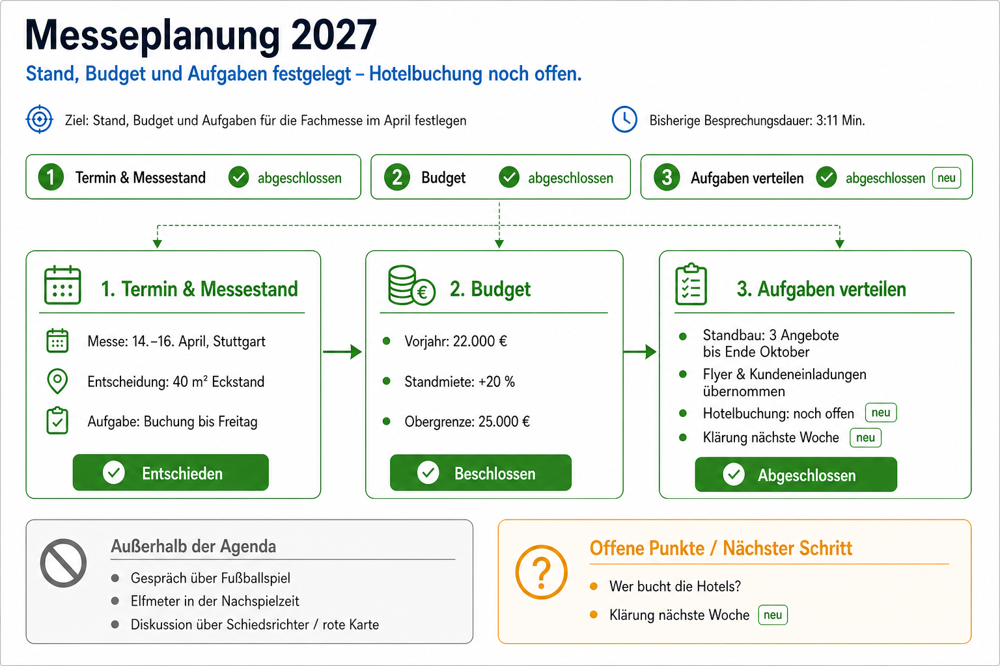

# Live Meeting Coach

KI-gestützter Meeting-Assistent (Hackathon, isb Open Innovation). Ein sichtbarer Co-Pilot, der
nicht das Meeting übernimmt, sondern der Gruppe hilft zu bemerken, wann sie Zeit, Fokus oder
Gesprächsfluss verliert. Der Mensch entscheidet, die Anwendung zeigt nur Hinweise.

Grundlage: **Lastenheft „KI-gestützter Meeting-Assistent (MVP)“** (02.10.2026) und die
Version-2-Spezifikation für echte Meetings in [docs/spezifikation.md](docs/spezifikation.md).

## Was das Dashboard zeigt

- **Mitte: Live-Bild** – ein One-Pager zum Stand des Meetings (Kernaussage, Themen mit Status,
  Entscheidungen, offene Fragen, Beziehungen, Abschweifungen). Claude zeichnet ihn auf Knopfdruck,
  alle 10 Minuten und am Ende (~1,5–2 min je Bild) und schreibt das letzte Bild dabei fort.
- **Links:** Countdown des aktuellen Punkts, Agenda mit Status, Vorschlag zum Weiterschalten.
- **Rechts:** vier Signale (Monolog, Agenda & Zeit, Fokus, Sprecherüberlappung), aktueller Hinweis,
  Redeanteile ohne Bewertung.
- **Unten:** Live-Transkript mit laufendem Teiltext (nur Moderationsansicht).
- Gruppenansicht für den Beamer: `/?ansicht=gruppe`.

## Schnellstart (Windows, Laptop)

```powershell
python -m venv .venv
.venv\Scripts\python -m pip install -r requirements.txt
.venv\Scripts\python scripts\modelle_laden.py   # lokale Modelle (~29 MB)
.venv\Scripts\python -m coach
```

Dann <http://127.0.0.1:8000> in Edge oder Chrome öffnen.

**Demo:** [demo/](demo/README.md) – ein dreiminütiges Meeting zum Abspielen im Dashboard, mit Screenshots und
der Meeting-Zusammenfassung als Bild.



- **Eigener OpenAI-Schlüssel:** Jede Person trägt ihren API-Schlüssel im Dashboard unter Einstellungen ein
  (wird bei OpenAI geprüft, liegt dann nur in `~/.live-meeting-coach/openai_schluessel`, nie im Browser oder Log).
  Alternativ `OPENAI_API_KEY` in `.env`; der Eintrag im Dashboard hat Vorrang. Live-Text, Kontext, Nestor und
  Live-Bild laufen alle über diesen einen Schlüssel. Grobe Kosten je Meetingstunde: ~2 $ mit Bild alle 10 min.
- **Live-Text schnell oder sparsam** (Einstellungen): Standard ist „schnell“ (Streaming, Text schon beim
  Sprechen, ~1,02 $/h). „Sparsam“ schickt jede Äußerung einzeln (~0,36 $/h); Sätze erscheinen erst nach dem Satzende (im Mittel ~1 s, bis ~4 s)
  und Nestor antwortet entsprechend später. Sprecher, Redeanteile, Monolog und Unterbrechungen sind nicht betroffen.
- **Live-Bild über das Claude-Abo statt OpenAI** (kostenlos, Layout einfacher): `LMC_BILD_ANBIETER=claude`;
  braucht die Claude-Code-Kommandozeile mit angemeldetem Abo (Standard: Pi per `LMC_CLAUDE_BEFEHL`).
- **Testbibliothek:** Proben mit Referenz in [testbibliothek/](testbibliothek/README.md); Audio herstellen
  mit `scripts\bibliothek_laden.py`, danach im Dashboard unter „Aufnahme abspielen“. Kopflos mit
  Bericht: `scripts\abspielen.py`; Sprechertrennung messen: `scripts\bench_sprecher.py`.
- **Gesprächsregeln:** was prüfbar ist und wie wir es testen – [docs/gespraechsregeln.md](docs/gespraechsregeln.md).
- **Sprachassistent „Nestor“:** begrüßt die Runde, fragt nach Einverständnis, antwortet auf Ansprache wie im
  ChatGPT-Sprachmodus – [docs/sprachassistent.md](docs/sprachassistent.md).
- **Ohne KI-Kosten:** `LMC_OFFLINE=1` (dann kein Live-Text, keine Fokus-Analyse).
- **Kosten:** jeder API-Aufruf wird ohne Inhalte und mit geschätzten Dollar in `logs/nutzung.jsonl` protokolliert;
  die Münze in der Kopfleiste zeigt das laufende Meeting nach Funktion, pro Stunde, heute und insgesamt
  (Listenpreise in `coach/kosten.py`).
- **Tests:** `.venv\Scripts\python -m pytest`

## Aufbau (Version 2: Ströme statt Blöcke)

| Strom | Datei | Technik |
|---|---|---|
| Audio | `static/app.js` | Browser-Mikro, durchgehend, PCM 24 kHz über WebSocket |
| Pausen | `coach/vad.py` | Silero VAD, lokal |
| 1 Live-Text | `coach/livetext.py` | OpenAI `gpt-live-transcribe`, Teiltext während des Sprechens |
| 2 Wer spricht | `coach/stimmen.py` | Stimm-Fingerabdruck (CAM++) in 1,5-s-Fenstern, lokal – Benchmark 99 % (Stadtrat) / 95 % (Talkshow), Raumtest offen |
| 4 Kontext | `coach/themen.py` | Zuordnung zum Agendapunkt per GPT-5.4-mini, alle ~15 s Gesprochenes |
| 5 Live-Bild | `coach/bild_gpt.py`, `coach/onepager.py` | Standard: GPT-5.4 + gpt-image-2 wie in ChatGPT, Fortschreibung des letzten Bildes (~55 s, ~8 ct); Alternative: Claude-Abo, SVG (`LMC_BILD_ANBIETER=claude`) |
| Sprachassistent | `coach/assistent.py`, `coach/gespraech.py` | Ansprache per Name im Live-Text, Realtime-Gespräch (gpt-realtime) bzw. Rückfall GPT-5.4-mini + Sprachausgabe |
| Regeln, Signale | `coach/analyse.py`, `coach/entscheider.py` | Ampeln, Countdown, Cooldown |
| Zusammenführung | `coach/hoeren.py`, `coach/pipeline.py` | Hörstrom, Meeting-Zustand, Abspielmodus |

Version 1 (blockweise Transkription mit OpenAI-Diarisierung, `coach/transkription.py`) ist als
Rückfallweg noch vorhanden.

## Mitmachen

Ideen und Aufgaben bitte als [Issue](../../issues) anlegen.
