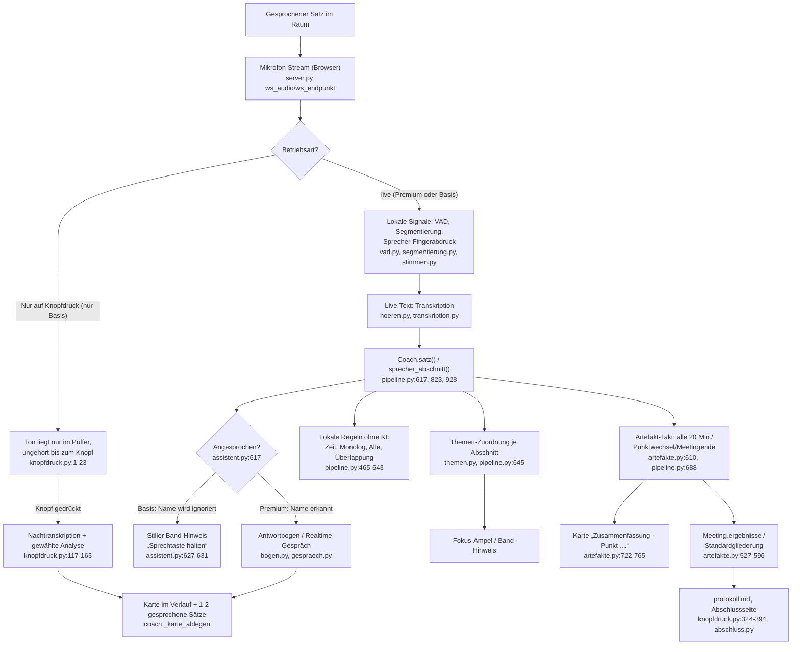

# Prompt-Lenkung nachvollziehbar dokumentieren (Ticket #68, Teil 1)

Diese Seite beantwortet drei Fragen zu Nestor: **Wie wird aus einem gesprochenen Satz eine Karte, eine
Antwort oder ein Protokoll-Eintrag? Was fließt dabei in die KI-Aufrufe? Und wie stark lenken wir sie?**
Alle Angaben sind mit Datei und Zeile belegt (Pfade relativ zu `coach/`, Stand dieser Branch). Prompts werden
nicht wörtlich abgeschrieben, nur ihre Kernaussage zusammengefasst – kurze Zitate sind gekennzeichnet.

Eine Einschränkung vorweg: Dieses Dokument beschreibt, was der Code **vorsieht**. Ob eine Funktion in einem
konkreten Meeting tatsächlich gelaufen ist, hängt von Einstellungen ab, die beim Start gewählt werden
(Stufe, „Nur auf Knopfdruck“, gewählte Regeln) – dazu mehr in Abschnitt 4.

## 1. Überblick: vom gesprochenen Satz zur Karte

Zwei Dinge fallen beim Lesen des Codes auf, die für den Rest des Dokuments wichtig sind:

- **Zwei fast unabhängige Weichen entscheiden, was läuft:** die *Stufe* (Premium = OpenAI, Basis = Mistral,
  `config.py:191`) und der *Modus* (`live` oder `knopfdruck`, nur in Basis wählbar, `api_start.py:19,62-64`).
  Beide zusammen bestimmen, welche der unten beschriebenen Funktionen automatisch laufen und welche nur auf
  Knopfdruck.
- **„Angesprochen werden“ und „Artefakte erkennen“ sind zwei getrennte Mechanismen.** Dass Nestor in Basis
  nicht auf seinen Namen hört, heißt nicht automatisch, dass auch die Ergebnis-Erkennung ausfällt – das wird
  in Abschnitt 4 genau auseinandergenommen.

## 2. Die einzelnen Funktionen

### 2.1 Agenda-Dialog (Vorbereitung, Text und Sprache)

| Auslöser | Modul/Funktion | Modell Premium / Basis | Was in den Prompt fließt | Lenkungsmittel | Bei Fehlschlag |
|---|---|---|---|---|---|
| `POST /api/agenda/vorschlag` (Text/Tabelle) bzw. `POST /api/agenda/sprache` (Audio, vorher transkribiert) – nur vor Meetingstart, `api_agenda.py:16-24,32-69` | `agenda_prompt.agenda_vorschlagen()`, `agenda_prompt.py:118-139` | `EINST.analyse_modell`: Premium `gpt-5.4-mini`, Basis `mistral-medium-latest` (Stufenschalter in `config.py:233`) – agenda_prompt.py selbst unterscheidet nicht | Freitext/Tabelle/Mailtext der Eingabe, die bisherige Agenda-Tabelle als JSON, die letzten 8 Dialogbeiträge (`dialog_nachrichten`, `agenda_prompt.py:108-115`) | Systemprompt: „sei Planungsassistent, kein Feld-Extraktor – entwickle aus einer freien Beschreibung 3-8 passende Punkte mit Ziel, frage nur bei echter Unklarheit nach“ (`agenda_prompt.py:17-54`); `response_format=json_object`; `normalisieren()` klemmt Längen und Minuten (1-240), erzwingt eine Rückfrage, wenn kein Punkt einen Titel hat (`agenda_prompt.py:80-105`) | Kein stiller Ausfall: ein Wiederholungsversuch bei kaputtem JSON, danach feste Fehlerantwort, bisherige Tabelle bleibt unverändert (`agenda_prompt.py:122-139`); Verbindungsfehler kommen als HTTP 502 ohne Fehlertext zurück (`api_agenda.py:27-29`) |

Läuft technisch identisch in beiden Stufen – nur das Modell darunter wechselt automatisch mit der Stufe.

### 2.2 Begrüßung

| Auslöser | Modul/Funktion | Modell Premium / Basis | Was fließt ein | Lenkungsmittel | Bei Fehlschlag |
|---|---|---|---|---|---|
| Meetingstart, wenn Assistent aktiv (`pipeline.py:743-744` → `assistent.begruessen()`) | Premium „frei“: `Begruessung` (Realtime-Gespräch), `begruessung.py:230ff`, gestartet aus `assistent.py:486-515`; „fest“ (Standard Basis, Fallback überall): `begruessungstext()`, `assistent.py:258-281` | Premium frei: `EINST.realtime_modell` = `gpt-realtime` (`config.py:122`); Basis optional frei (`LMC_BASIS_BEGRUESSUNG_FREI`, Standard **aus**): `basis_begruessung_modell` = `mistral-small-latest` (`config.py:131-133`); feste Fassung kommt ohne Modellaufruf aus vorformulierten Textbausteinen | Assistentenname, gewählte Regeln, Meeting-Titel/Ziel/Agenda, ob eine Vorstellungsrunde folgt, eine fixe Liste von Pflichtinhalten (laut Agent-Recherche `begruessung.py:127-141`) | Pflichtinhalte werden nach dem **tatsächlich gehörten** Text geprüft, nicht nach dem vollen Modelltext (`pflicht_fehlt()`, `hoerbar()`); fehlt etwas, schiebt Nestor einen festen Nachsatz nach statt alles neu zu sagen; `einwand_sekunden` (7 s, `config.py:151`) hält ein Zeitfenster offen, in dem ein einfaches „Nein“ alles verwirft (`pipeline.py:1090-1108`) | Kein stiller Ausfall: Premium hat zwei Timeouts (`begruessung_frist_ton` 8 s auf den ersten Ton, `begruessung_max_sekunden` 120 s Gesamtdauer, `config.py:128-129`) – reißt eines, folgt automatisch die feste Fassung; Basis-frei hat ein 2-Sekunden-Timeout, sonst ebenfalls die feste Fassung (laut Agent-Recherche `begruessung.py:465-489`) |

### 2.3 Ansprache/Antwortbogen – Premium Realtime-Gespräch vs. Basis Sprechtaste

Dies ist der Kern dessen, was sich nach „Moderator, der mitdenkt“ anfühlen soll.

**Premium** öffnet bei „Nestor, …“ eine laufende Realtime-Sitzung (`gespraech.py`, `EINST.realtime_modell`).
Die Persona-Anweisung (`gespraech.py:81-97`) gibt in eigenen Worten vor: kurz antworten (höchstens zwei
Sätze), Einzelheiten gehören auf die Karte, keine Personenbewertung, nie raten – vor jeder Antwort muss das
Modell über ein eigenes Werkzeug (`status_abfragen`, `gespraech.py:57-61`) den aktuellen Stand abfragen statt
ihn aus dem Gesprächsbeginn zu schätzen. Für Bild, Recherche, Karten, Agendawechsel, Pause/Ende und das
Eintragen von Artefakten stehen acht Funktionswerkzeuge zur Verfügung (`gespraech.py:30-79`), u. a.
`artefakt_eintragen` für „Sofie übernimmt die Statusseite bis Freitag“.

**Basis** hat keine laufende Sitzung. Der Name wird **grundsätzlich ignoriert** – `funkgeraet` ist in Basis
immer wahr, unabhängig vom Modus `live`/`knopfdruck` (`assistent.py:421-423`); in `satz()` führt das dazu,
dass bei erkannter Ansprache nur ein stiller Hinweis „Sprechtaste halten, dann fragen“ ins Band geht, höchstens
einmal pro Minute (`assistent.py:627-631`, `pipeline.py:923-926`). Eine Frage kommt in Basis nur über die
gehaltene Sprechtaste (`halten_start/-_ende`, `assistent.py:580-608`) oder getippt herein; von dort läuft sie
durch denselben „Bogen“ wie in Premium (`annehmen()` → `bogen_starten()`, `assistent.py:704-736`).

| | Premium | Basis |
|---|---|---|
| Ansprache | Name „Nestor“ im Live-Text (`angesprochen()`) | ignoriert; Sprechtaste |
| Antwortkanal | Offene Realtime-Sitzung, unterbrechbar | Ein Modellaufruf je Frage + TTS, nicht unterbrechbar |
| Modell | `gpt-realtime` (Gespräch), `EINST.assistent_modell` = `gpt-5.4-mini` (Bogen-Inhalte, Einordnung) | `EINST.assistent_modell` = `mistral-medium-latest` für alles |
| Rückfrage ohne erneuten Namen | Ja, `nachfrage_sekunden` = 6 s Fenster (`config.py:140`) | Aus (`nachfrage_sekunden` = 0.0 in Basis, `config.py:239`) |
| Lenkung der Bogen-Inhalte | Je Bogen-Art eigener Prompt in `bogen.py` (z. B. `STAND`, `FRAGE` in `knopfdruck.py:173-189`, wiederverwendet von `bogen.py:329-346`); Format erzwungen über `response_format=json_object`; ein zusätzlicher Modellaufruf formuliert den gesprochenen Satz dazu (`moderationssatz()`, `bogen.py:208-233`, 5 s Frist, Ersatztext bei Fehlschlag) | Gleiche Bausteine, gleiche Prompts – nur das Modell darunter wechselt |
| Bei Fehlschlag | `moderationssatz()` liefert einen Ersatzsatz statt nichts (`bogen.py:223-233`); der Knopf-Pfad (`knopfdruck.ausfuehren`) setzt sichtbar `k.fehler` und sendet es ans Dashboard (`knopfdruck.py:153-157`) | gleich – Knopf-Fehler sind nicht still |

Die Entscheidung „ist dieser Satz nach einer Antwort noch eine Nachfrage an Nestor?“ läuft dreistufig: zwei
feste Regeln (`jemand_anderes`, `klar_an_nestor`, `bogen.py:79-99`), dann eine dritte Regel, die prüft, ob der
Satz eher an die Runde selbst anschließt (`knuepft_an_runde`, `bogen.py:128-135`), erst dann ein kleiner,
knapp befristeter Modellaufruf (`einordnen()`, 2,5 s Frist, im Zweifel „nicht an Nestor“, `bogen.py:159-188`).
Das ist eine der am genauesten dokumentierten Lenkungsentscheidungen im ganzen Projekt – mit konkreten
Beispielsätzen aus echten Probeläufen in den Kommentaren.

### 2.4 Themenzuordnung/Fokus

| Auslöser | Modul/Funktion | Modell P/B | Was fließt ein | Lenkungsmittel | Bei Fehlschlag |
|---|---|---|---|---|---|
| Nach jedem transkribierten Block (`_segmente_verarbeiten`, `pipeline.py:563`) bzw. wenn ein gleitendes Fenster schließt – nach 5 s Stille oder spätestens 15 s nach dem ersten neuen Satz, mindestens 4 s neu gesprochen (`_abschnitt_takt`, `pipeline.py:990-1008`, Werte `config.py:81-85`) | `themen.zuordnen()`, `pipeline.py:645-676` | `EINST.zuordnung_modell or EINST.analyse_modell`: Premium `gpt-5.4-mini` (`analyse_aufwand=low`), Basis `basis_zuordnung_modell` = `mistral-small-latest` (`config.py:660`, `234`) | Ziel + Agenda mit aktivem Punkt, bis zu ~30 s vorheriger Kontext, der neue Abschnitt (`themen.nachricht()`, `themen.py:48-59`) – **keine Namen** | Systemprompt verlangt neutrale inhaltliche Zuordnung in eine von fünf Kategorien (aktiv/vorgriff/zurück/neu/unklar) plus Konfidenz und Begründung (`themen.py:11-28`); bei gewählter Regel „Respektvoller Ton“ läuft die Ton-Prüfung im selben Aufruf mit (`themen.py:32-44`); `normalisieren()` erzwingt gültige Kategorie und Konfidenz 0-1 (`themen.py:62-78`) | Kaputtes JSON → leeres Objekt (`themen.py:92-95`); der Aufrufer fängt Exceptions, loggt und setzt `coach.fehler` als Text für das Dashboard (`pipeline.py:664-667`) – sichtbar, aber nur als Statuszeile, nicht als Karte |

### 2.5 Regeln und Hinweise im Band – was ist lokal ohne KI?

Vier der acht umgesetzten Regeln kommen **ganz ohne Modellaufruf** aus, reiner lokaler Code:

- **Zeit einhalten** – Countdown aus der geplanten Dauer (`pipeline.py:480-498`).
- **Sich kurz fassen** – zusammenhängende Redezeit ≥ `monolog_sekunden` (`pipeline.py:567-582`).
- **Alle kommen zu Wort** – Redeanteile zählen, Schwellen `alle_still_minuten`/`dominanz_anteil` (`pipeline.py:584-607`).
- **Ausreden lassen** – Überlappung/Zickzack rein aus Zeitstempeln (`pipeline.py:616-643`).

Drei Regeln brauchen ein Modell – und zwar genau dieselben Aufrufe, die ohnehin für Themenzuordnung und
Artefakte laufen, es gibt keinen eigenen Zusatzaufruf:

- **Beim Thema bleiben** (Fokus-Ampel) – Teil der Themenzuordnung, Abschnitt 2.4.
- **Respektvoller Ton** – läuft im selben Themen-Aufruf mit, nur mit zusätzlichem `TON`-Prompt-Baustein (`themen.py:32-44`, nur an die Moderation, nie mit Namen, `pipeline.py:693-704`).
- **Ergebnisse festhalten** – ist die Markierung von Lücken in den Artefakt-Karten (Abschnitt 2.6/2.9).

Drei Regeln sind im Katalog, aber **nicht umgesetzt** (kein Code dahinter): „Keine Seitengespräche“,
„Sachlich bleiben“, „Zuhören und aufeinander eingehen“ (`regeln.py:44,57-60`) – sie erscheinen in der
Einrichtung nicht zur Auswahl, weil `gueltige()` nur umgesetzte Regeln durchlässt (`regeln.py:85-88`).

Jeder Hinweis läuft durch den `Entscheider`, der Reizüberflutung verhindert: `vorschlagen()` unterdrückt
denselben Hinweis-Schlüssel für `cooldown_sekunden` (Standard 90 s, `config.py:154`), `einmalig()` lässt einen
Schlüssel nur ein einziges Mal im Meeting zu (`entscheider.py:14-40`).

### 2.6 Ergebnisse/Artefakte (Aufgaben, Entscheidungen, offene Punkte, Risiken)

| Auslöser | Modul/Funktion | Modell P/B | Was fließt ein | Lenkungsmittel | Bei Fehlschlag |
|---|---|---|---|---|---|
| Drei automatische Anlässe: Agendapunkt endet (`punkt_wechseln`, `pipeline.py:678-691`), 20 Minuten am selben Punkt (`artefakte.takt()`, `artefakte.py:610-628`, Wert `abschnitt_minuten` `config.py:145`), Meetingende (`hoeren_beenden`, `pipeline.py:755-789`); dazu auf Zuruf/Bogen das Nachholen des laufenden Abschnitts (`nachholen()`, `artefakte.py:717-719`) | `Artefakte.erkennen()`/`abschnitt_abschliessen()`, `artefakte.py:657-769` | `EINST.analyse_modell`: Premium `gpt-5.4-mini`, Basis `mistral-medium-latest` (`artefakte.py:654`) | Agenda, bereits festgehaltene Artefakte **mit Nummer** (damit das Modell ergänzt statt doppelt anlegt), bis zu 40 s Kontext, die neuen Sätze – in Stücken von höchstens 6000 Zeichen (20-Minuten-Fenster) bzw. 3500 Zeichen parallel bei Zuruf (`artefakte.py:52-55, 234-243, 630-650`) | Systemprompt definiert die vier Typen mit konkreten Signalwörtern und was ausdrücklich **nicht** dazugehört (Ankündigungen zum Ablauf, Fragen an Nestor selbst, Berichte über Vergangenes, `artefakte.py:182-228`); explizite Korrekturregeln für „nicht X, sondern Y“ und gemeinsame Termine; `normalisieren()`/`MIN_KONFIDENZ=0.4` filtern unsichere Treffer (`artefakte.py:56`) | **Nicht einheitlich sichtbar**: Im sequenziellen Pfad bricht ein fehlgeschlagenes Stück die Verarbeitung der restlichen Sätze ab, nur `log.warning`, **keine** Markierung in `coach.fehler` (`artefakte.py:680-691`) – das Dashboard zeigt nichts Auffälliges. Der Knopf-Pfad (`_protokoll`, s. u.) zeigt Fehler dagegen sichtbar an |

Siehe Abschnitt 4 für die konkrete Einordnung dieser Fehlerlücke anhand des Pilot-Vorfalls.

### 2.7 Überblick

| Auslöser | Modul/Funktion | Modell P/B | Was fließt ein | Lenkungsmittel | Bei Fehlschlag |
|---|---|---|---|---|---|
| Auf Zuruf/Bogen, bei Meetingende in Basis, oder als Basis-Ersatz des Live-Bilds (kein Bildmodell in Basis) – `ueberblick_starten()`, `pipeline.py:1204-1216`, `1270-1272` | `ueberblick.erstellen()` | `EINST.analyse_modell` – Premium `gpt-5.4-mini`, Basis `mistral-medium-latest` | Volles Transkript bis 30.000 Zeichen bzw. nur der aktive Punkt bei Fokus „aktuell“, festgehaltene Ergebnisse je Agendapunkt, der vorherige Überblick zum Abgleich „was ist neu“ (laut Agent-Recherche) | Prompt verlangt, nur Belegtes zu übernehmen, nichts zu ergänzen/runden; eine Nachprüfung verwirft Zahlen, die nicht im Ausgangsmaterial stehen, und ersetzt „Person N“ durch „jemand“ | Kaputtes JSON gefangen; Fehler wird sichtbar als `onepager_fehler` gesetzt (`pipeline.py:1234-1236`) – erscheint im Dashboard |

### 2.8 Zusammenfassung

Der Bogen „Zusammenfassen“ ruft **keinen eigenen Prompt** auf, sondern zuerst `artefakte.nachholen()` (holt
den laufenden Abschnitt nach), bildet dann lokal eine Auswahl aus den letzten Entscheidungen/Aufgaben/offenen
Punkten und formuliert dazu per `moderationssatz()` einen gesprochenen Satz (`bogen.py:283-300`). Die stille
Abschnitts-Karte „Zusammenfassung · Punkt …“ beim Punktwechsel oder nach 20 Minuten läuft über denselben
Mechanismus wie Abschnitt 2.6 (`artefakte.py:722-765`).

### 2.9 Lücken

„Was fehlt?“ (`bogen.fehlt()`, `bogen.py:303-311`) holt ebenfalls erst den laufenden Abschnitt nach und zeigt
dann alle Artefakte mit fehlenden Pflichtfeldern (`Artefakt.luecken()`, `artefakte.py:121-150` – je Typ fest
definiert, z. B. Aufgabe braucht „was/wer/bis“). Das ist **reine Logik, kein Modellaufruf** – die Lücken
selbst entstehen als Nebenprodukt der Erkennung aus 2.6. Automatisch fragt Nestor nur einmal pro Lücke nach
(`nachgefragt`-Flag, `artefakte.py:757-763`) und nur, wenn die Konfidenz der Erkennung über `FRAGE_KONFIDENZ`
(0.5) liegt und die Regel „Ergebnisse festhalten“ gewählt ist – sonst bleibt die Karte sichtbar, aber Nestor
fragt nicht mit der Stimme nach.

### 2.10 Recherche

| Auslöser | Modul/Funktion | Modell P/B | Was fließt ein | Lenkungsmittel | Bei Fehlschlag |
|---|---|---|---|---|---|
| Erkannter Rechercheauftrag im Zuruf (`B.recherche_auftrag`, über `assistent.annehmen()` → `_recherche()`, `assistent.py:878-907`) | `recherche.py` | `EINST.recherche_modell`: Premium `gpt-5.4-mini` mit `web_search`-Werkzeug über die Responses-API, Basis `basis_text_modell` = `mistral-medium-latest` über die Mistral-Conversations-API mit Websuche | Nur die vom Assistenten formulierte Frage + Meetingtitel – **bewusst ohne Transkript, ohne Namen** (Vorgabe im Werkzeug selbst: „ohne Interna aus dem Meeting“, `gespraech.py:40-44`) | Prompt verlangt 3-5 konkrete Ergebnisse mit Quellen und Datierung, Hinweis bei unklarer Lage; kein striktes JSON-Schema (Fließtext); ohne gefundene Quellen wird ein Disclaimer vorangestellt | Exception wird geloggt, dem Nutzer erscheint eine Karte mit Fehlertext statt nichts (`assistent.py:884-894` laut Agent-Recherche) |

### 2.11 Protokoll/Abschluss

`knopfdruck._protokoll_md()` (`knopfdruck.py:324-370`) baut das Markdown-Protokoll **ohne eigenen
Modellaufruf** direkt aus den schon erkannten Artefakten (2.6), gegliedert nach Agendapunkt mit sichtbaren
„fehlt: …“-Markierungen. Ausgelöst wird es über den Protokoll-/Zusammenfassen-/Was-fehlt-Knopf oder automatisch
am Meetingende in Basis (`_protokoll_am_ende`, `pipeline.py:806-816`). `coach/abschluss.py` und
`api_abschluss.py` lesen danach nur noch aus `meeting.json`/`bericht.json` und formatieren die Abschlussseite
– hier läuft überhaupt keine KI mehr, es ist reine Aufbereitung des vorher erkannten Stands.

## 3. „Fühlt es sich nach schlauem Moderator an?“ – ehrliche Bewertung

Der Code ist an vielen Stellen sehr bewusst auf genau dieses Gefühl hin gebaut: Antworten sind kurz, Karten
tragen die Details, Nestor fragt lieber einmal zu viel beim Stand nach als zu raten, und die Kommentare im
Code dokumentieren auffällig viele reale Probeläufe, aus denen einzelne Regeln entstanden sind. Trotzdem gibt
es Stellen, an denen die Lenkung heute gegen dieses Gefühl arbeitet:

1. **Basis ignoriert die Ansprache komplett, ohne dass das irgendwo laut gesagt wird.** `funkgeraet` ist in
   Basis immer wahr (`assistent.py:421-423`); „Nestor, …“ erzeugt nur einen leisen Band-Hinweis, höchstens
   einmal pro Minute. Für jemanden, der Premium kennt, wirkt das wie Ignorieren, nicht wie ein bewusst
   gestuftes Produkt. *Vorschlag:* Beim Umschalten auf Basis einmal deutlich (nicht nur als Textzeile im
   Band) erklären, dass die Sprechtaste der einzige Weg ist. Aufwand: **S**.
2. **Künstliche Trennung zwischen „automatisch erkannt“ und „per Knopf erzwungen“ – Fehler aus dem
   automatischen Pfad sind still** (Abschnitt 2.6, `artefakte.py:680-691`): Schlägt ein Hintergrund-Aufruf der
   Artefakt-Erkennung fehl, sieht niemand das. *Vorschlag:* dieselbe sichtbare Fehlerbehandlung wie beim
   Knopf-Pfad (`coach.fehler` setzen, Band-Hinweis). Aufwand: **S**.
3. **Themenzuordnung sieht nur ein kurzes Fenster (15 s, maximal ~40 s mit Vorlauf) und keine Namen.** Ein
   Moderator, der mitdenkt, würde sich an länger Zurückliegendes erinnern und wüsste, wer spricht. Aktuell
   kann ein Rückbezug über mehrere Minuten hinweg verloren gehen. *Vorschlag:* das Kontextfenster für die
   Fokus-Prüfung moderat vergrößern und mit echten Protokollen aus `docs/testlauf_*` gegen Fehlalarme prüfen.
   Aufwand: **M**.
4. **Ergebnisse entstehen nur gebündelt (Punktwechsel/20 Minuten/Zuruf), nie Satz für Satz.** Das ist eine
   bewusste Entscheidung (Ticket #27, `artefakte.py:7-11`) gegen Kosten und Lärm – spürbar ist aber, dass eine
   klar gesagte Aufgabe erst mit Verzögerung auf der Karte landet, nicht sofort wie ein aufmerksamer Mitschreiber
   es täte. *Vorschlag:* bei sehr klaren Signalwörtern („ich übernehme X bis Freitag“) eine sofortige
   Mini-Erkennung zulassen, ohne auf den ganzen Abschnitt zu warten. Aufwand: **M**.
5. **Basis und Premium benutzen zwar dieselben Prompts, aber ein anderes, kleineres/günstigeres Modell ohne
   „reasoning_effort“** (Mistral kennt den Parameter nicht, `config.py:235`). Die Qualität der Zuordnung,
   Artefakt-Erkennung und Antworten ist damit in Basis grundsätzlich schwerer vorhersagbar als in Premium,
   ohne dass das an irgendeiner Stelle im Produkt sichtbar wäre. *Vorschlag:* im Dashboard an geeigneter Stelle
   knapp markieren, dass Basis mit einem anderen Modell arbeitet (nicht nur im Impressum/Kosten-Bereich).
   Aufwand: **S**.
6. **Der Claude-SVG-Bildweg (`onepager.py`, `onepager_analyse_modell`/`onepager_zeichen_modell`) ist toter
   Code** – `config.py:208-211` erzwingt beim Start immer `bild_anbieter="openai"`, egal welche Umgebungsvariable
   gesetzt ist, und `pipeline.py:1296-1297` wirft eine Ausnahme für jeden anderen Anbieter. Das ist für die
   Lenkung selbst harmlos, aber es ist eine stille Diskrepanz zwischen Konfigurationsmöglichkeit und
   tatsächlichem Verhalten, die bei der nächsten Umbauaktion leicht übersehen wird. *Vorschlag:* toten Code und
   ungenutzte Einstellungen entfernen oder den Pfad wirklich reaktivieren. Aufwand: **S**.
7. **Die Einordnung „ist das noch eine Frage an Nestor?“ ist die am sorgfältigsten dokumentierte Lenkung im
   ganzen Projekt** (Abschnitt 2.3) – das ist positiv zu nennen, zeigt aber im Umkehrschluss, wie uneinheitlich
   die Dokumentationstiefe zwischen den Modulen ist. Nicht als Fehler, aber als Hinweis, wo als Nächstes genauer
   hinzuschauen wäre, wenn sich etwas falsch anfühlt. Aufwand: **-** (keine Maßnahme, nur Beobachtung).

## 4. Warum wurden im Pilot keine Ergebnisse befüllt?

Das Review hat festgehalten, dass das betroffene Meeting in **Basis** lief und Basis „Nestor, …“ **absichtlich**
ignoriert (nur Sprechtaste). Die Frage ist, ob die **Artefakt-Erkennung** (Aufgaben/Entscheidungen/offene
Punkte/Risiken) davon überhaupt betroffen sein sollte – und unter welchen Bedingungen sie trotzdem leer bleibt.

**Das Ignorieren der Ansprache und die Artefakt-Erkennung sind zwei getrennte Mechanismen.** Dass Basis nicht
auf „Nestor, …“ reagiert (`assistent.py:421-423, 627-631`), verhindert nur, dass per Sprachbefehl ein Artefakt
**bestätigt eingetragen** wird (`assistent_aktion`, `pipeline.py:1082-1088`, Premium-Pendant: das Werkzeug
`artefakt_eintragen`, `gespraech.py:62-72`). Die **automatische Erkennung** aus dem laufenden Transkript läuft
davon technisch unabhängig. Ob sie in diesem Pilotmeeting trotzdem lief, hängt vom zweiten, unabhängigen
Schalter ab:

- **War der Betriebsmodus `live` (Basis ohne „Nur auf Knopfdruck“)?** Dann läuft `Artefakte.erkennen()`
  automatisch – beim Agendapunktwechsel (`pipeline.py:688-691`), nach 20 Minuten am selben Punkt
  (`artefakte.py:610-628`) und am Meetingende (`hoeren_beenden`, `pipeline.py:768-776`). In diesem Fall **sollte**
  die Erkennung gelaufen sein. Dass trotzdem nichts ankam, wäre dann am ehesten durch den stillen Fehlerpfad zu
  erklären: Schlägt der Mistral-Aufruf fehl (z. B. Schlüssel, Rate-Limit, Netzwerk), wird das nur geloggt
  (`log.warning`, `artefakte.py:689-691`) – **`coach.fehler` wird dabei nicht gesetzt**, anders als beim
  Transkriptions- oder Themen-Fehler (vgl. `pipeline.py:539-543, 664-667`). Das Dashboard hätte in diesem Fall
  nichts Auffälliges angezeigt, während die Karten einfach ausblieben – ein stiller Ausfall, der sich exakt wie
  der beschriebene Pilot-Befund liest.
- **War „Nur auf Knopfdruck“ aktiv?** Dann ist die automatische Erkennung von vornherein abgeschaltet – das
  steht ausdrücklich im Code: „Im Modus 'Nur auf Knopfdruck' erkennt Nestor nichts von selbst – nur der
  Protokoll-Knopf schickt Text an das Modell“ (`artefakte.py:20`, technisch abgesichert in `artefakte.py:622,
  732` und `pipeline.py:937-944`). In diesem Fall bleiben Ergebnisse leer, bis jemand ausdrücklich den Knopf
  „Protokoll“, „Zusammenfassen“ oder „Was fehlt?“ drückt (`knopfdruck.py:373-394`) – kein Softwarefehler,
  sondern eine Bedienlücke: Niemand im Pilot hat offenbar diesen Knopf gedrückt, und nichts im Produkt macht
  aktiv darauf aufmerksam, dass genau dieser Knopf nötig ist (`AGENDA_BITTE`, `knopfdruck.py:50-51`, erwähnt
  nur den Agenda-Wechsel, nicht ausdrücklich das Festhalten von Ergebnissen).

**Welcher der beiden Fälle vorlag, lässt sich aus dem Code allein nicht entscheiden** – dafür bräuchte es den
gespeicherten Modus dieses Meetings (`meeting.json`/`nestor_zeiten.jsonl` des betroffenen Laufs, die laut
Auftrag hier nicht zitiert werden sollen). Beide Fälle sind aber real existierende Lücken im heutigen Code und
beide passen zum beschriebenen Symptom „Ergebnisse wurden nicht mehr befüllt“, ohne dass irgendetwas im
Dashboard einen Alarm ausgelöst hätte. Für die Praxis heißt das: Punkt 2 aus Abschnitt 3 (sichtbare Fehler auch
im automatischen Pfad) behebt den einen Fall; eine deutlichere Erinnerung an den Protokoll-Knopf im
Knopfdruck-Modus behebt den anderen.
